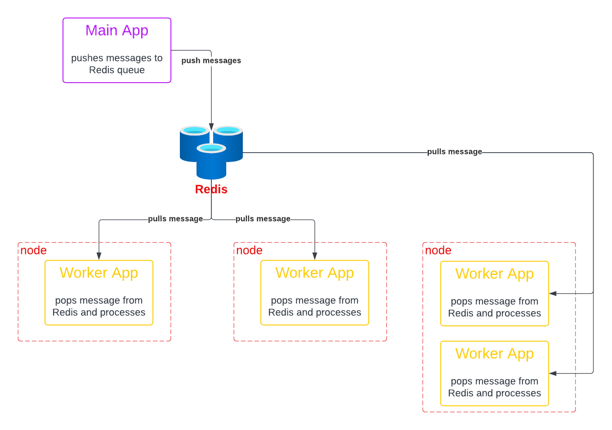
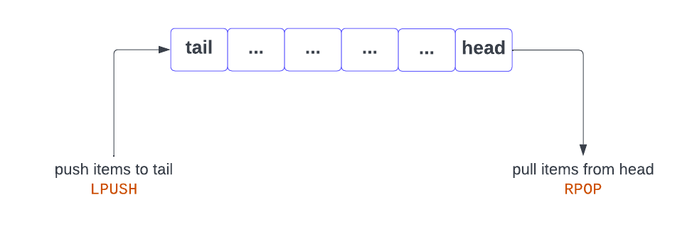

# Distributed Computations with Python and Redis

In this post I want to show you one frequent way I use a queue mechanism to distribute work
in a highly scalable way.

I often get questions about using sub processes in Python to scale applications. Although
this is definitely an option, it is not one I use (I don't use multi threading either, but that's for 
another discussion!). So, yes, sub processes can scale to multiple cores or CPUs on your computer, but it is limited 
to a **single** computer.

Most problems that need scaling these days will need to scale beyond just a single computer - maybe not in the 
short term, but eventually, as our data sets grow ever larger and larger, scaling to a single computer, even with 16 
or 32 cores is not going to be enough. In that case, we have to find a solution that can scale across
multiple computers, and this would mean refactoring a lot of the code that I would have had to put in place for 
multiprocessing.

The method I use (almost always) involves setting up data processing pipelines using message queues.

The idea is extremely simple.

1. A "main" program kicks off the entire process, and eventually "divides" the concurrent work to be done into 
   chunks that are put into a queue. The queue items, or *messages*, essentially contain all the information they need to 
   define the inputs for the work that has to be done (it might even be links to records in a database, but the 
   idea is the same - each item in the queue contains the information needed to complete the required work)
2. I create a second application which simply takes items from the queue, one by one, performs the work
   required for that queue item, "saves" the result (maybe to a database, maybe to another queue), and once done
   processing the item, looks in the queue for the next item to process. Rinse and repeat. This application can
   be run on as many computers (nodes) as we want, and even as many times on the same computer as we want. 
   These running instances of this application are often called **workers** ( or worker processes).



Like many concurrency problems, one of the key things here is that the **order** in which the items are handled
from the queue should not have any bearing on the final result. If that is not the case, then the approach we are 
looking at may not work (or would require some additional code). Even if we deal with a FIFO queue 
(first-in first-out), there is no guarantee that the results of processing the queue items would be emitted 
in that same order (one worker in the system may simply be running faster than another).

So, given that we are OK with that, we can then run as many of these worker processes as we want, and scale the number
of worker processes up or down as needed. We may even elect to run these workers on a single computer, even the 
same one generating the queue items in the first place. The advantage is that we can start small, running everything on
a single computer, but if need be, we can easily scale the system to multiple processing nodes.

Here's a concrete example where I have used this in the past.

We need to do some image processing, which involves converting an image to some standard format (say JPEG), create
multiple versions at different resolutions and crops. These images come in over time via some mechanism (maybe someone
uploads the image on our web site). This original image, and associated data is then saved to a database and file 
system, and a queue item is created to point to the file and the database record. Independent worker processes, are
listening for items in the queue, and once one becomes available, one of the workers picks up the item and starts
the image processing. Once complete, new images are saved to a file system somewhere, and the database record updated 
to reflect processing was completed, and links to the newly created images.

As you can see, this approach is **very** easy to understand (I don't do complicated well, I like to keep things 
simple), and yet we have a highly scalable system if we need it.

So, to do this we need:
1. a message queue where we can push and pop messages that can be accessed on the network
2. a Python app that pushes concurrent chunks of work to this queue
3. another Python app that pops items from the queue, and performs the work

One important thing for this to work, is the ability to make sure that once a worker "picks up" an item from the
queue, no other worker can pick it up (after all, we only need to process each item just once).

There are many queue platforms that would work very well for this. My most frequent goto platform is RabbitMQ - it 
is feature rich and provides a very robust and scalable queue infrastructure. Slightly simpler to set up would be 
Amazon's SQS or elasticMQ, but many other message queue platforms exist as well (Kafka, ActiveMQ, etc).

Another possibility is using Redis list as a queue - it is simple enough, and comes 
without the additional complexity of using some of the other options, is often already available in projects I work on,
but unlike Rabbit or SQS it is not necessarily 100% foolproof (worker could crash in the middle of processing a 
queue item, in which case the event may get lost - but there is a solution to that, see the last section in this 
README.)

To use Redis as a queue, we are going to use a list item, and push/pull from either the left or the right of the list.




In future episodes I could cover how to work around the potential message loss issue in Redis, or cover a more robust 
queue mechanism such as SQS (or elasticMQ) - let me know in the comments, and if there's enough interest I'll make 
another video(s).


## Getting things set up
In this folder you will find a few things:
1. A docker compose file that we'll use to stand up a local Redis instance (you'll need Docker)
2. A folder named `app` that contains our main app (the one that pushes data to Redis)
3. A folder named `worker` that contains the Python worker app
 
In each Python app folder, you will find a `requirements.txt` file that you will need to create the virtual environment
to run each Python app.

Our apps are not going to do much.

The main app is just going to push items onto the queue, and the worker app is going to pop items off the queue and 
just generate a log entry that it has processed the item. 

In practice, I would add a few things to make the system more robust - in particular, a way to requeue items that the
worker failed to process for some reason (many full-blown queue systems have a concept of a dead letter queue (DLQ) that
helps with this). Redis does not have a DLQ concept, but we could create another queue in Redis to mimic that.

Since I do want to handle re-queuing in this demo, I will keep a counter of how many attempts were made to process
an item, and simply emit an error level log after N times. (in practice, we would probably dead letter the message, 
and set up some monitoring/alerting on the DLQ).

To start a local Redis instance, use:
```bash
docker compose up -d
```

The docker compose file maps defines which port to use for communicating with Redis - here we have `6379`, but
you can always map it to another port on your computer if it clashes with something else.

For example, to map the container Redis port to `6699`, you would simply change your docker compose file from
```yaml
    ports:
      - '6379:6379'
```

to 
```yaml
    ports:
      - '6699:6379'
```

If you do change the port, you will need to change that in the config files for both main and worker apps as well.

Once you have Redis up and running, you can run the main app to generate events, and as many instances of the worker app 
as you want.


## Running Things
First, we'll run the main app - this will push one message per second to the Redis queue.

We can use the Redis cli to quickly query Redis and see if your messages are being pushed.

To get the Redis cli, we can use

```bash
docker compose run redis redis-cli -h redis -a secret -n 0
```

We can then issue commands such as:
- `ping` - should get `PONG` response
- `keys *` - lists out all keys in Redis - initially this should be empty, but once we start our main 
   app, we should see one entry for our queue (key should be `demo-1`)
- `lrange demo-1 0 -1` - this lists our all the messages in the queue (a Redis list)


Next we can start as many workers as we want, and we should observe the processing happening. We can
also verify, using the Redis query above, that the queue (list) is changing over time as messages are added 
and removed.


## Possible Enhancements
- use another Redis database to de-duplicate messages - should not happen, but there may be concurrency
  race conditions (haven't encountered any yet, but just to be sure!), so you could store a successfully 
  processed message ID (with some TTL), and double check that the message was not already handled successfully 
  before handling it.
- implement another Redis queue as a DLQ, and monitor that for messages that simply cannot be handled for some reason
- potential loss of a message is there (worker dies after popping from the queue, but before completing its work). 
  In that case, it may be possible to use another Redis queue to store "in-process" items, and processing - see the 
  Redis documentation for [Pattern: Reliable Queue](https://redis.io/commands/lmove/) for more details. But if this
  becomes an issue, I will typically look at a more complete solution such as RabbitMQ, or SQS/elasticMQ.
